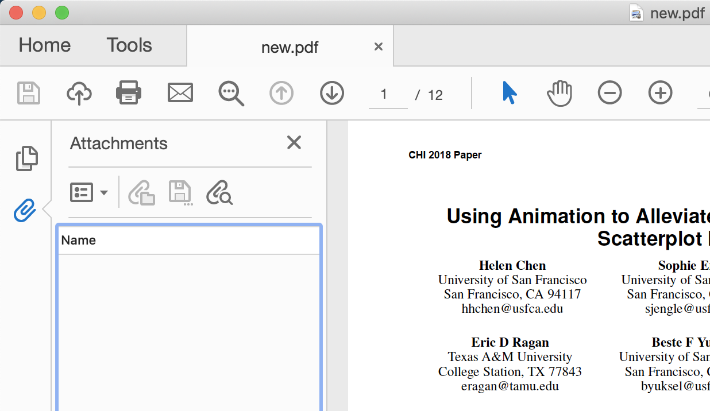

# PDF Embedding Code Attacks

PDF supports a lot of content formats such as text, HTML, CSS, JavaScript, etc.
You can also attach files in pdf files.
With the ability of using JavaScript in pdf files, there might be vulnerability.
The abstraction of this attack is to attach an executable file or a bash script, and use JavaScript to download the attachment then execute the file.

## PyPDF2

My approach uses PyPDF2 library to achieve the operation we discussed above.
PyPDF2 supports file attachment to a pdf file, the function I am using is ```addAttachment(filename, data)```.
The function for embedding JavaScript is ```addJS(script)```.

## Acrobat

Acrobat provides several functions and properties for manipulating the file attachments.
The function I am using here is ```this.exportDataObject({cName: filename,nLaunch: option})```.
We are using option "2" for the nLaunch argument which enable the "download then execute" operation.

## Results

After creating a new file with ```pdf_inject.py```, we open the pdf file with Adobe Acrobat Reader.
*(You need to use this reader to execute the JavaScript)*


You can see there's a ```mock.txt``` file attached to the pdf file.
The original file I attached to it was sh file but I mocked the format as a text file.


The Acrobat Reader detected the attachment was not text file so it pop out a window to ask if the user would like to download the file or not.
It also warned the user that this could be a malicious code. 


Not thing happened if you really open the file.



The newer version of Adobe Acrobat Reader has some mechanisms to prevent the attack like this.
I am looking into some other ways to achieve the goal.

## Author

Chien-Yu (Brian) Sung

## References

0. [PyPDF2](https://pythonhosted.org/PyPDF2/PdfFileWriter.html?highlight=addAttachment)
1. [Acrobat](https://acrobatusers.com/tutorials/importing-and-exporting-pdf-file-attachments-acrobat-javascript)
